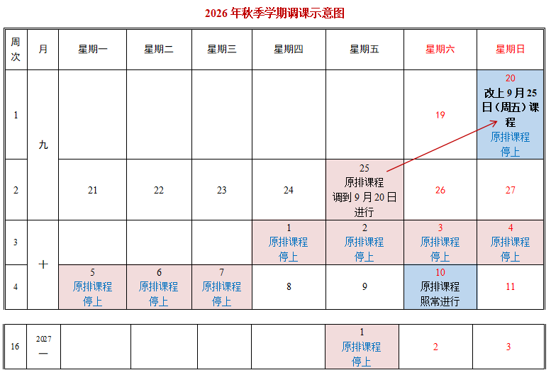

# 2026秋季学期操作系统课程安排
今年的课程安排是参考去年操作系统课的课程安排的情况， 并进行一些适应性的调整后的结果。同学们可以通过去年的安排了解今年课程安排的大致情况，从而合理安排自己的学习时间表。

## 往年参考
+ [2025秋季学期操作系统课程安排](https://www.yuque.com/xyong-9fuoz/qczol5/yxlm5rty65h013c8)
+ [2024秋季学期操作系统课程安排](https://www.yuque.com/xyong-9fuoz/qczol5/hg32m3ft4cpgcagn)
+ [2023秋季学期操作系统课程安排](https://www.yuque.com/xyong-9fuoz/qczol5/su9882q18oat2n8r)
+ [2022秋季学期操作系统课程安排](https://www.yuque.com/xyong-9fuoz/qczol5/ll05fn)

## 课表
|     | | 星期一    | 星期二    | 星期三    | 星期四    | 星期五    | 星期六    | 星期日    |
| --- | --- | --- | --- | --- | --- | --- | --- | --- |
| 上午    | 第1节(08:00-09:35)    |     |     |     |     |     |     |     |
| | 第2节(09:50-12:15)    |     | 30240243 三教3304;1-12周 |     |  |     |     |     |
| 下午 | 第3节(13:30-15:05) |  | | | | | | |
| | 第4节(15:20-16:55) |  | | | | 30240243 三教3304;1-12周 | | |

### 调课安排

## 课程安排
依据[2026年秋季学期清华大学校历](https://www.tsinghua.edu.cn/xl/2026qiuji.jpg)，在开学前对操作系统课的日程安排如下。这个安排在教学过程中有可能进行临时的微调。故这个日程仅供同学们参考。

| 周次    | 时间(可能微调)    | 教学安排    | 课堂视频 | 主讲教师    | 课后练习和实验    |
| --- | --- | --- | --- | --- | --- |
| 第一周    | 周二(20260915) |  |          |          |                |
| | 周五(20260918) |  |          |          |                |
| | 周日(20250920)：上09月25日（周五）的课 |  |          |          |                |
| 第二周 | 周二(20260922) |  |          |          |                |
|     | 周五(20260925) | 中秋节假期 |          |          |                |
| 第三周    | 周二(20260929) |  |          |          |                |
| | 周五(20261002) | 国庆假期 |  |  |  |
| 第四周    | 周二(20261006) | 国庆假期 |  |  |  |
| | 周五(20261009) |  |          |          |                |
| 第五周    | 周二(20261013) |  |          |          |                |
| | 周五(20261016) |  |          |          |                |
| 第六周    | 周二(20261020) |  |          |          |                |
| | 周五(20261023) |  |          |          |  |
| 第七周    | 周二(20261027) |  |          |          |                |
| | 周五(20261030) |  | |          |                |
| 第八周    | 周二(20261103) |  |          |          |  |
| | 周五(20261106) |  |          |          |                |
| 第九周    | 周二(20261110) |  |          |          |                |
| | 周五(20261113) |  |          |          |                |
| 第十周    | 周二(20261117) |  |          |          |                |
| | 周五(20261120) |  |          |          |  |
| 第十一周    | 周二(20261124) |  |  |          |                |
| | 周五(20261127) |  |  |          |                |
| 第十二周    | 周二(20261201) |  |  |          | |
| | 周五(20261204) |  |  |          | |
| 第十三周    | 周二(20261208) |  |  |  | |
|  | 周五(20261211) |  | |          |  |

